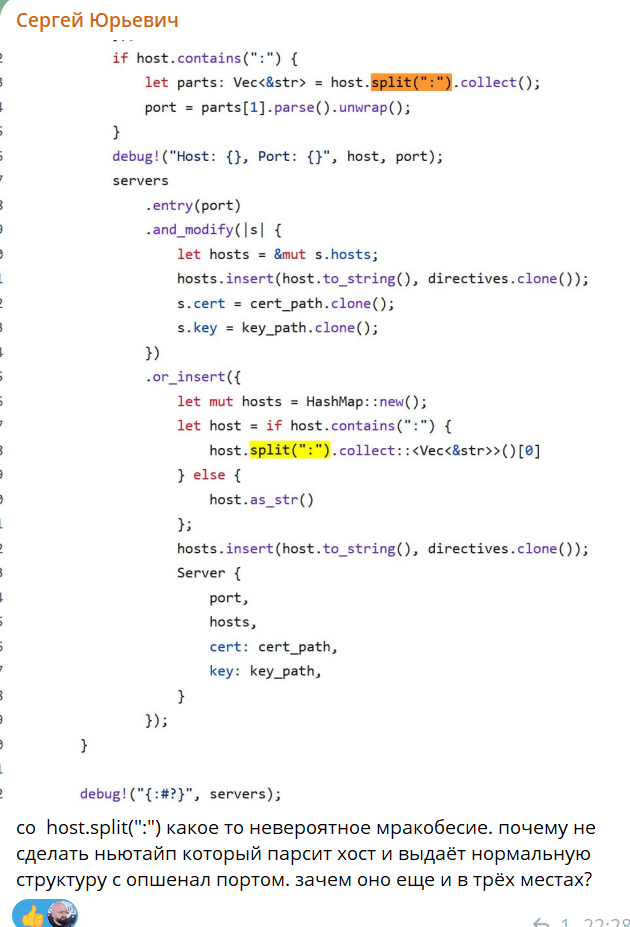
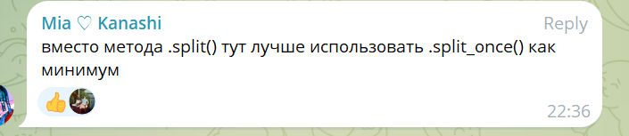
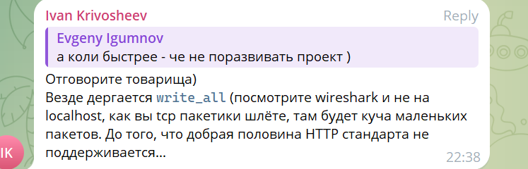
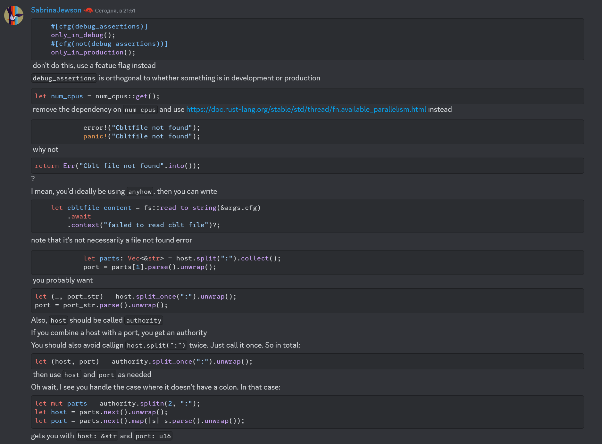
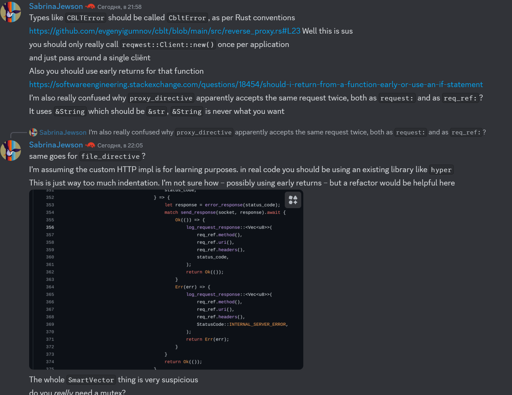
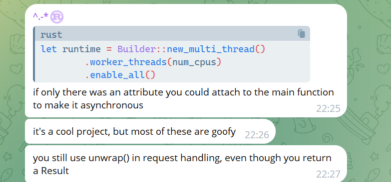

```
walking through ur changes now

`                    host.split(":").collect::<Vec<&str>>()[0]`
split is an iterator, you can just call `next()` instead of allocating every segment


cs.bu.edu/~hwxi/atslangweb/ — Сегодня, в 21:47
it also is lazy, so you can avoid going through everything, instead just going to the first : and stopping there
НОВОЕ
[21:47]
by calling next()
````












